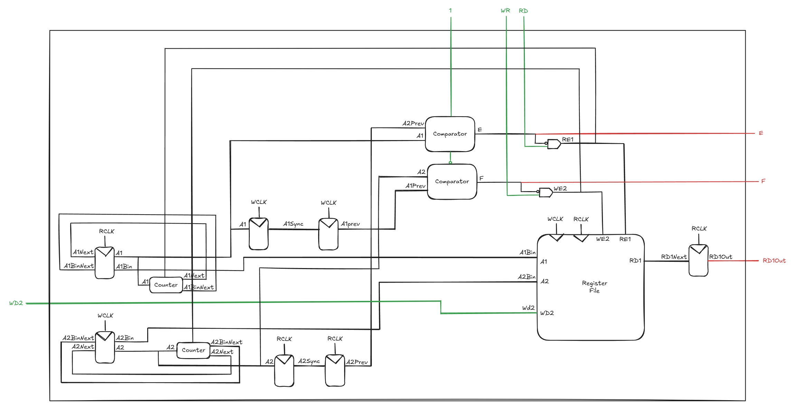

# Asynchronous FIFO Buffer

An asynchronous FIFO buffer implemented in SystemVerilog with a depth of 64 and a width of 32 bits. Reads have a latency of 2 clock cycles and writes have a latency of 1. Clock domain crossing is handled with two dual-flip-flop synchronizers. The design includes overflow and underflow protection, and correctly handles simultaneous read and write operations.

## Datapath Diagram


## Project Structure
```
async-fifo/

├── data/         # Numeric input data

├── images/       # FIFO diagram

├── scripts/      # Python scripts

├── src/          # Main SystemVerilog source files

├── tb/           # Testbench files
```

## Installation

### 1. Prerequisites
- **Questa** (included with Quartus Prime Lite)

### 2. Clone the Repository
```bash
git clone https://github.com/tebsjejsn/async-fifo.git
cd async-fifo
```

## Running the Project

### 1. Program Setup
- Open the repository in Visual Studio Code to browse and edit source files.
- Launch Questa, find the transcript window, and change the working directory to the folder of async-fifo

### 2. Compilation
> Run the following in the Questa transcript window (this is Tcl syntax, not a shell command)
```
vlib work
vmap work work
vlog -sv {*}[glob src/*.sv] {*}[glob tb/*.sv]
```

### 3. Load the Testbench
```
vsim -voptargs="+acc" work.tb
```

### 4. Run the Simulation
- Go to the sim window, right-click module named "tb", and select Add > To Wave > All items in region
- Type run -all in the Questa transcript window

## (Optional) Add Unique Operations/Operands

### 1. Insert New Data
- Write new tests in `tb/tb.sv` (add extra wait time after the FIFO transitions from empty or full, since the empty/full flags need two cycles to propagate across the clock domains), or use `generate.py` to produce a random data sequence:
```bash
python3 scripts/generate.py
```

### 2. Repeat Steps
- Follow the previous steps to run the simulation

## License
Distributed under the MIT License. See `LICENSE` for more information.